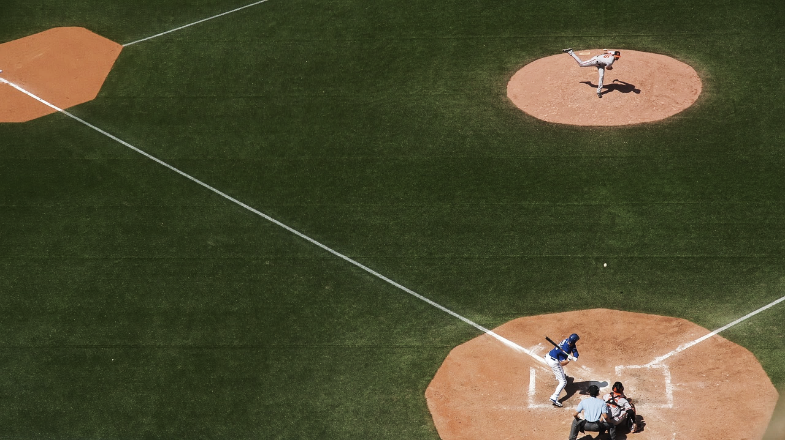
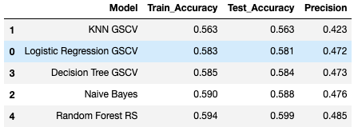
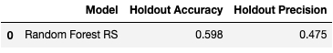

# Swing or Take? *Predicting MLB Strikes*

[Michael Jordan](https://www.linkedin.com/in/michaeljoshuajordan/)  
February 2020 

## Table of Contents
* [Overview and Motivation](#overview-and-motivation)
* [Methodology](#methodology)
* [Tools and Technologies](#tools-and-technologies)
* [Results and Conclusions](#results-and-conclusions)
* [Acknowledgments](#acknowledgments)

## Overview and Motivation
Making solid contact with a pitch thrown in Major League Baseball (MLB) is one of the hardest things to do in professional sports.
- **Problem**: *How can a batter optimize their chance of making solid contact during an at bat?*

Arguably, one of the most important variables that makes hitting a pitch difficult is not knowing whether the pitch will be thrown within the strike zone (be called a strike) or outside of it (be called a ball). Typically, a pitch thrown within the strike zone is easier to hit than one that is not.
- **Goal:** *Predict whether a major league pitch will be a called strike or not in order to recommend whether a batter should swing or take the pitch with less than 2 strikes in the count.*

## Methodology 
Implementation of this project involved: 

1. Obtain pitch-level data for every pitch thrown during the 2015-2018 MLB regular seasons, where each row represents a single pitch. Create a master dataframe combining the following 3 csv files obtained from Kaggle:  
      a. atbats  
      b. pitches  
      c. games 

2. Create a target value that can be predicted (Strike = 1, Ball = 0). Perform feature selection and engineering to identify potential real-world model inputs a hitter could use when attempting to predict whether a strike or ball would be thrown when there are less than 2 strikes already in the count. [Code found here.](https://github.com/jordanm3/mlb-strike-predictions/blob/master/feature_selection_engineering.ipynb) 

3. Test different combinations of features on a range of metrics (accuracy, precision, recall and f1 scores) using Logistic Regression as a baseline model. [Code found here.](https://github.com/jordanm3/mlb-strike-predictions/blob/master/feature_selection_engineering.ipynb) Select a final subset of features to use as inputs for a final model (see jupyter notebook for a description of each field):  
      a. Strike/Ball Count  
      b. Number of Outs  
      c. Pitcher Fatigue (# of pitches thrown)  
      d. Runners on Base  
      e. Score (Pitcher's Team)  
      f. Pitch Type  
      g. Pitcher/Hitter Position

4. Determine the most important metrics to use in evaluating a final model. In addition to overall accuracy, precision was prioritized since the primary goal of this model is to make a recommendation on whether a hitter should swing at a pitch. With this in mind, it is important to be sure that a pitch that is predicted to be a strike is actually a strike if a hitter is going to commit to swinging at it. 

5. Test selected inputs using various classifier models to determine which model performs best in accuracy and precision. [Code found here.](https://github.com/jordanm3/mlb-strike-predictions/blob/master/model_selection.ipynb) Models tested included:  
      a. Logistic Regression  
      b. K-Nearest Neighbors (KNN)  
      c. Naive Bayes Classifier  
      d. Decision Tree Classifier  
      e. Random Forest Classifier

## Tools and Technologies
- Key python libraries:  
      a. Pandas (Dataframe cleaning and manipulation)   
      b. Matplotlib / Seaborn (Visualizations)  
      c. LogisticRegression / KNeighborsClassifier / GaussianNB / DecisionTreeClassifier / RandomForestClassifier (Classifier models)

- PostgreSQL (Data storage, manipulation and retrieval)

- Tableau (Visualizations for feature importance scores)

## Results and Conclusions
**Model Performance Comparison**:

- Random Forest Classifier optimized using random search yielded the best accuracy and precision scores.

**Final Model Holdout Results**:

**Final Thoughts**:
- An "ensemble classifier" ended up providing the best performance for my selected metrics (accuracy and precision).
- When considering the feature importance scores of the inputs used in my model (see feature_selection_engineering.ipynb for a ranking of the top features), it is recommended that hitters pay most attention to the following factors when predicting if a strike will be thrown:  
      a. Balls/strikes already in the count  
      b. Runners on base  
      c. Total pitch count of the current pitcher
- Presentation slides for this project can be found [here.](https://github.com/jordanm3/mlb-strike-predictions/blob/master/Swing%20or%20Take%20-%20Predicting%20MLB%20Strikes.pdf)

## Acknowledgments
- The work for this project was done as my 3rd project for the [Metis Data Science Bootcamp](https://www.thisismetis.com/data-science-bootcamps) and could not have been done without the support and guidance of my instructors and cohort.

- The datasets for my model were obtained from Kaggle and can be found [here.](https://www.kaggle.com/pschale/mlb-pitch-data-20152018#games.csv)
